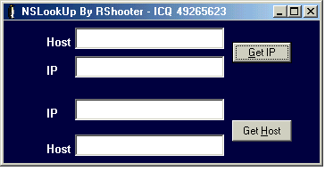



## NSLOOKUP FOR WINDOWS

### Description

This Program Can Transform DNS in IP and IP in DNS. Like NSLookup in Unix systems. I Like you apreciate and vote! :) Thanks
 
### More Info
 

             |
---                |---
**Submitted On**   |2002-03-29 21:03:36
**By**             |[Rodrigo 'Shooter'  Marx](https://github.com/Planet-Source-Code/PSCIndex/blob/master/ByAuthor/rodrigo-shooter-marx.md)
**Level**          |Intermediate
**User Rating**    |4.8 (87 globes from 18 users)
**Compatibility**  |VB 5\.0, VB 6\.0
**Category**       |[Internet/ HTML](https://github.com/Planet-Source-Code/PSCIndex/blob/master/ByCategory/internet-html__1-34.md)
**World**          |[Visual Basic](https://github.com/Planet-Source-Code/PSCIndex/blob/master/ByWorld/visual-basic.md)
**Archive File**   |[NSLOOKUP\_F666763292002\.zip](https://github.com/Planet-Source-Code/rodrigo-shooter-marx-nslookup-for-windows__1-33209/archive/master.zip)

### API Declarations

Many :) See in code.

